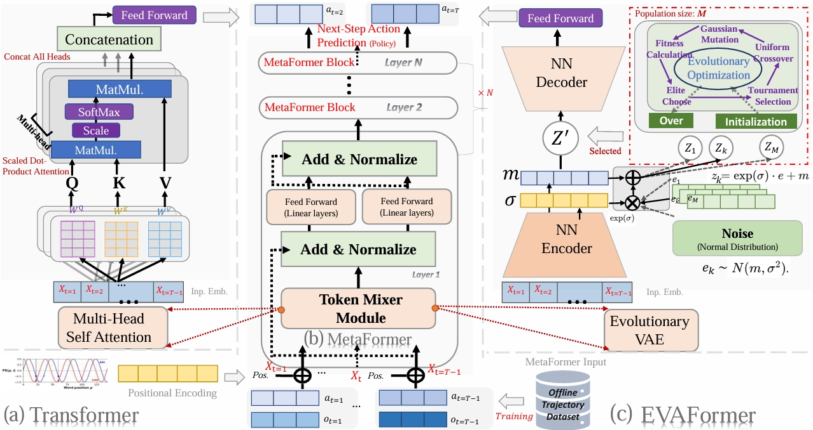
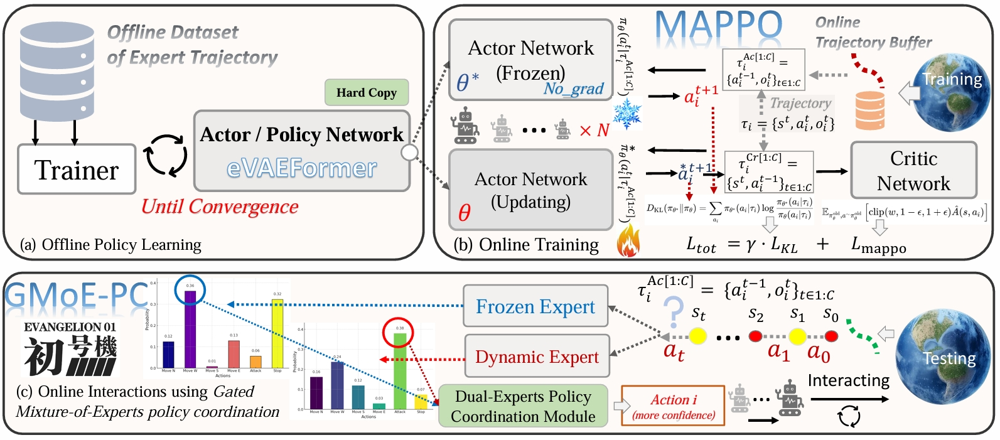
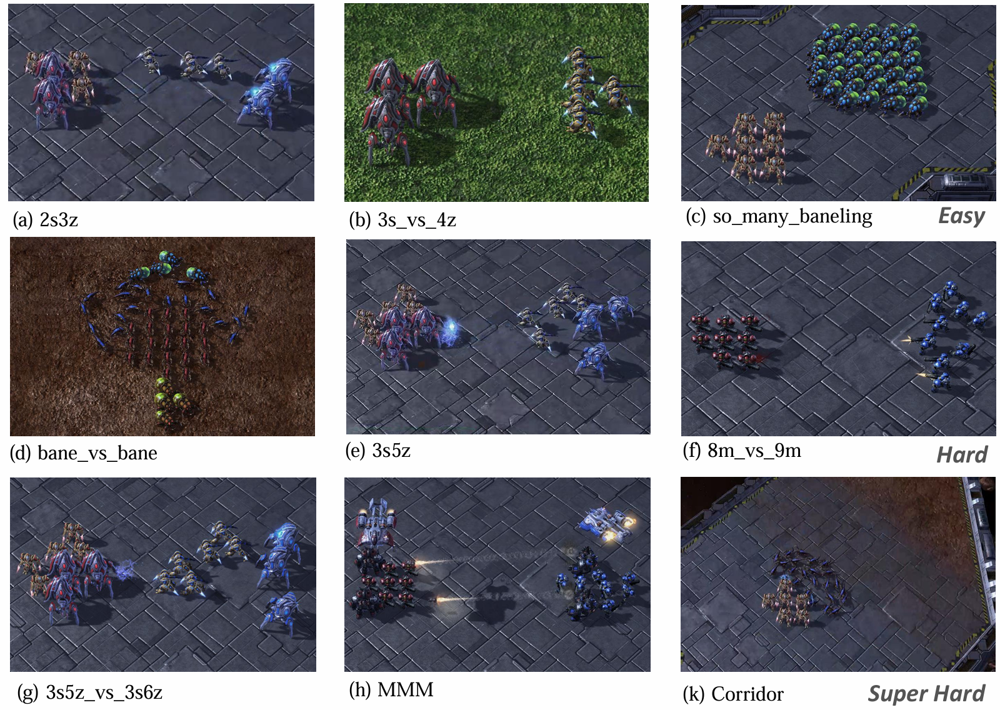
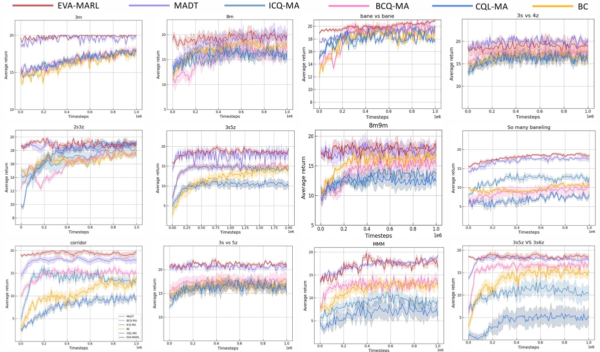
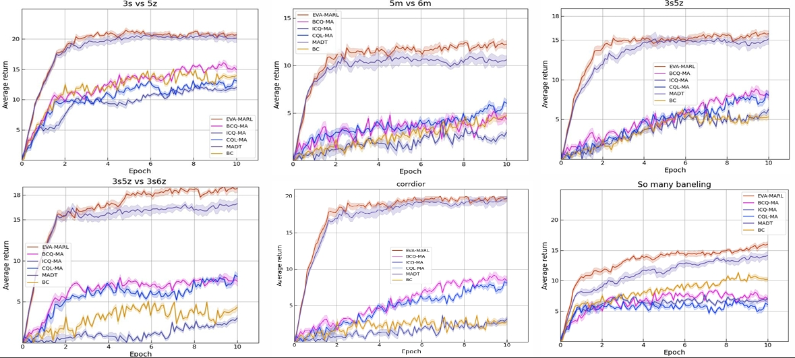
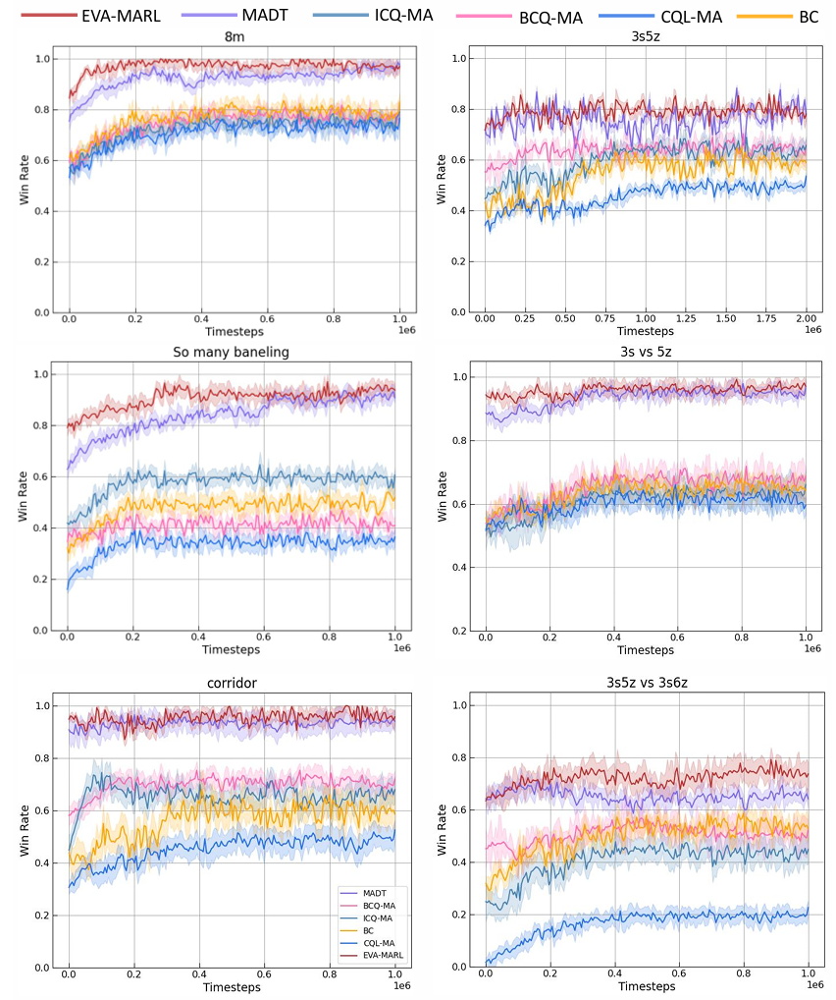
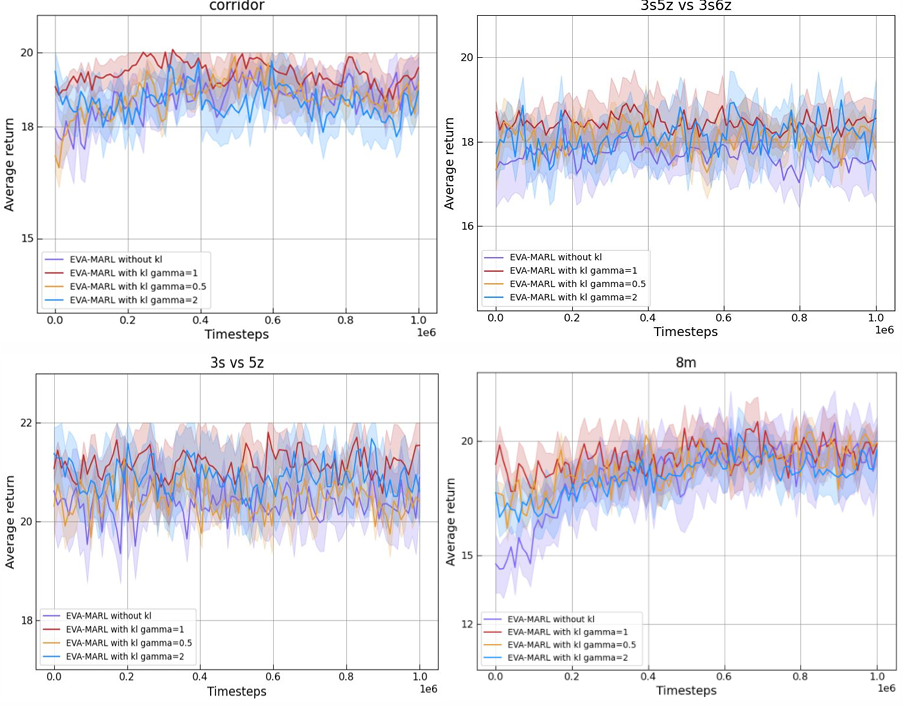
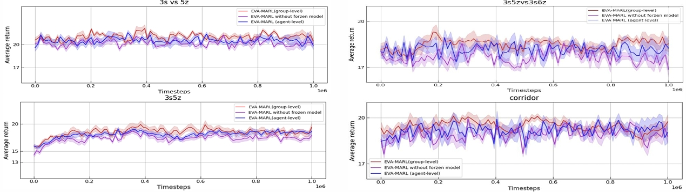

# EVA-MARL: Evolutionary Variational Autoencoder-enhanced MetaFormer Actor with Dual-Experts Policy Coordination for Efficient Offline-to-Online MARL (StarCraft II)

[](https://opensource.org/licenses/MIT)
[](https://www.python.org/downloads/)
[](https://pytorch.org/)

Official implementation of our IEEE TII submission:  
**"Evolutionary Variational Autoencoder-enhanced MetaFormer Actor with Dual-Experts Policy Coordination for Efficient Offline-to-Online MARL"**

[[Paper]](https://arxiv.org/abs/XXXX.XXXXX) | [[Project Page]](https://github.com/NICE-HKU/EVA-Offline-MARL-FineTuning) | [[SMAC Benchmark]](https://github.com/oxwhirl/smac)

---

## 🚀 Key Features
- **EVAFormer**: Novel Transformer variant integrating evolutionary VAE into Metaformer architecture  
- **GMoE-PC**: Gated Mixture-of-Experts policy coordination for offline-to-online transition  
- **KL-Regularized Fine-tuning**: Maintains policy consistency during online adaptation  
- **State-of-the-art performance** on StarCraft II Micromanagement (SMAC) benchmark  
- **Robust OOD Generalization**: Superior handling of out-of-distribution states  
---
- Main Architecture of EVAFormer actor
<p align="center">
  
</p>

---
- Main Architecture of GMoE-PC

<p align="center">
  
</p>

---
## 🧩 Key Components
- **EVAFormer Architecture**: 
  - Replaces MHSA in Decision Transformer with evolutionary VAE token mixer
  - Enhanced generalization for OOD states through noise-injection mechanism
  - Superior temporal dependency modeling in POMDPs
- **GMoE-PC Mechanism**: 
  - Confidence-aware gating network routing between offline and online experts
  - KL-divergence regularization prevents catastrophic forgetting
  - Adaptive switching between conservative offline knowledge and online strategies
- **Two-Phase Learning**: 
  - Offline Training: Supervised imitation learning on expert trajectories
  - Online Fine-tuning: MAPPO-based adaptation with frozen offline expert 

---
## 📌 Installation

1. **Clone the repository**:
```bash
git clone https://github.com/NICE-HKU/EVA-Offline-MARL-FineTuning.git
cd EVA-Offline-MARL-FineTuning
```

2. **Install dependencies**:
```bash
pip install -r requirements.txt
bash install_sc2.sh
```

## 🌏 SMAC Environment Testbeds

The selected SMAC maps with progressive difficulty levels, ranging from Easy, Hard to Super-Hard, for evaluating offline MARL algorithms.

<p align="center">
  
</p>

## 🏃 Quick Start

Run offline pre-training + online fine-tuning (offline-to-online) on 3s5z map:
```bash
python run_madt_sc2.py --map_name 3s5z --cuda_id 0
```

## 🏆 Performance

- Performance Comparisons of Online Fine-tuning
---
<p align="center">
  
</p>

- Offline training performance comparison between theEVAFormer actor module of our EVA-MARL and SOTA baselines
---
<p align="center">
  
</p>

- Online fine-tuning win-rates between EVA-MARL and baselines across SMACmaps
---
<p align="center">
  
</p>

- Effect of KL Divergence Constraint Weight (Effect of Different KL Divergence Constraint Weight (γ) Settings on EVA MARL Performance Across Different Maps.)
---
<p align="center">
  
</p>

- Performance comparison between group-level and agent-level policy coordination of EVA-MARL
---
<p align="center">
  
</p>

## 🛠️ Customization
Modify `sc2/models/gpt_model.py` to:
- Adjust evolutionary VAE architectures
- Experiment with different token mixing strategies
- Tune KL-divergence regularization weights

Edit `sc2/framework/trainer.py` & `sc2/framework/rollout.py` to:
- Implement custom gating networks
- Modify expert selection strategies
- Adjust confidence thresholds

---

## 🤝 Contributing
We welcome contributions! Please open an issue or submit PRs for:
- ~~New SMAC scenarios~~
- Alternative policy coordination mechanisms
- Performance optimizations

This project is forked from [ReinholdM/Offline-Pre-trained-Multi-Agent-Decision-Transformer](https://github.com/ReinholdM/Offline-Pre-trained-Multi-Agent-Decision-Transformer), many thanks to their wonderful foundational research work.

## 📜 Citation
If you use this work, please cite:
```bibtex
@article{jin2025eva-marl,
  title={EVA-MARL: Evolutionary Variational Autoencoder-enhanced MetaFormer Actor with Dual-Experts Policy Coordination for Efficient Offline-to-Online MARL},
  author={Jin, Weiqiang and Du, Hongyang et al.},
  journal={IEEE Transactions on Neural Networks and Learning Systems (under review)},
  year={2025},
}
